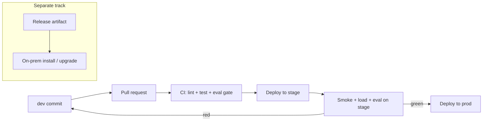

# Deployment Environments — dev / stage / prod / on-prem

One codebase, one image, **many environments**. The only thing that changes
between environments is **configuration** (env vars + secrets), never the code.
This is the "build once, promote everywhere" principle.

## The four tiers

| Tier | Purpose | Who uses it | Data | Uptime target |
|------|---------|-------------|------|---------------|
| **dev** | Fast iteration, may be broken | You | Fake/seed data | Best-effort |
| **stage** | Prod-like rehearsal, final checks | Team + QA | Anonymized copy of prod | Near-prod |
| **prod** | Real users, real money | Customers | Real data | Highest (SLO) |
| **on-prem** | Runs inside a customer's/your own datacenter | Regulated/air-gapped users | Stays on their network | Per contract |

### dev
- Local (`uvicorn --reload`) or a cheap cloud instance that scales to zero.
- Cheapest/smallest model, verbose logs, mock external services where possible.
- Secrets from a local `.env` (never committed).

### stage
- **Identical infra to prod**, smaller size. This is where you catch "works in
  dev, breaks in prod" issues.
- Runs the full CI gate: tests + evals + load test before promotion.
- Uses a **separate** secret store and database from prod.

### prod
- Real traffic. Strict SLOs, autoscaling, alerting, min-instances ≥ 1.
- Change only via CI/CD from `main` after stage passes. No manual edits.
- Least-privilege identity, private networking, budget alerts.

### on-prem
- Deployed inside a customer's datacenter or a private/air-gapped network.
- Common drivers: data residency, compliance (HIPAA/GDPR/gov), no egress.
- Runtime is usually **Kubernetes** or **Docker Compose**, not a managed cloud.
- LLM options: a **self-hosted model** (vLLM/Ollama/TGI) or an approved private
  endpoint. Secrets come from Vault/sealed-secrets, not a cloud manager.
- No outbound internet is assumed — vendor images via a private registry.

## What changes per environment (config matrix)

| Setting | dev | stage | prod | on-prem |
|---------|-----|-------|------|---------|
| `APP_ENV` | dev | stage | prod | onprem |
| Model | small/mock | prod model | prod model | self-hosted/private |
| Min instances | 0 | 1 | 2+ | fixed (nodes) |
| Max instances | 1 | 3 | autoscale | cluster limit |
| Log level | DEBUG | INFO | INFO/WARN | INFO |
| Secrets source | `.env` | cloud secret mgr | cloud secret mgr | Vault / k8s secrets |
| Tracing sample rate | 100% | 100% | 10–20% | 100% (local backend) |
| Public access | none | restricted | public + WAF | internal only |

Concrete example configs are in this folder:
- [config.dev.yaml](config.dev.yaml)
- [config.stage.yaml](config.stage.yaml)
- [config.prod.yaml](config.prod.yaml)
- [config.onprem.yaml](config.onprem.yaml)

> These YAML files are **non-secret** config only. Secrets are injected at
> runtime from each environment's secret store (see the Azure/GCP guides).

## Promotion flow (how code reaches prod)



Rules:
1. Never deploy straight to prod. Always dev → stage → prod.
2. Same image SHA promoted across environments (don't rebuild per env).
3. Each environment has its **own** secrets, database, and URL.
4. On-prem ships a **versioned release** (image + install docs), upgraded on the
   customer's schedule.

## How the app reads its environment
`APP_ENV` selects the tier; everything else comes from env vars/secrets. Load
the matching YAML for non-secret defaults, then override with env vars:

```bash
# dev
APP_ENV=dev uvicorn app.main:app --reload

# prod container (values injected by the platform)
APP_ENV=prod  # + secrets from the cloud secret manager
```

See the deep-dive guides:
- [../azure/README.md](../azure/README.md) — Azure from scratch
- [../gcp/README.md](../gcp/README.md) — GCP from scratch

## Checklist
- [ ] Four environments defined with separate secrets + data
- [ ] One image promoted dev → stage → prod (no per-env rebuilds)
- [ ] Stage mirrors prod infra
- [ ] On-prem path documented (runtime, model, secrets, upgrades)
- [ ] Prod protected: CI-only deploys, SLOs, budget alerts
