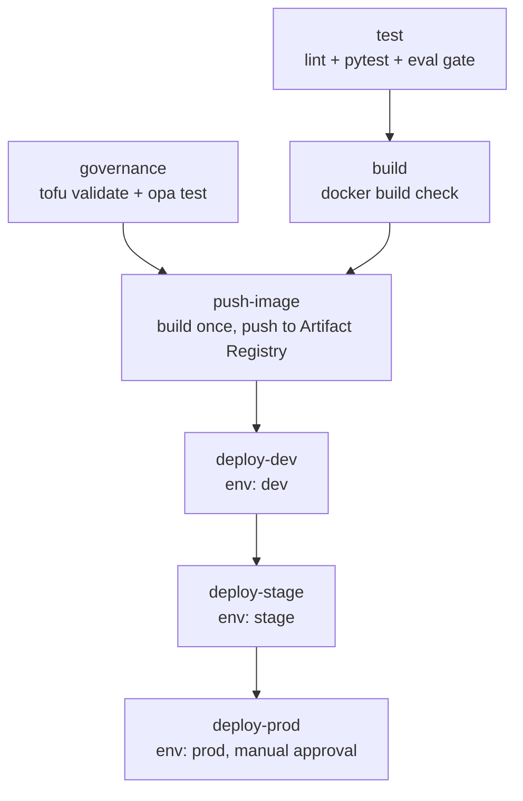

# Module 6 — Docker & CI/CD

**Goal:** reproducible builds and an automated pipeline: push → lint → test →
eval → build image → deploy.

## What's here
```
Dockerfile          # slim, multi-stage image for the FastAPI service
.dockerignore
../.github/workflows/ci.yml   # GitHub Actions pipeline (repo root)
```

## Build & run locally
```bash
docker build -t agentic-ai -f 06-docker-cicd/Dockerfile .
docker run -p 8000:8000 --env-file .env agentic-ai
curl localhost:8000/health
```

## Dockerfile principles
- **Multi-stage** — build deps in one stage, copy only what's needed to run.
- **Slim base** — `python:3.12-slim`; avoid full images.
- **Layer caching** — copy `requirements.txt` and install *before* copying code.
- **Non-root user** — don't run as root.
- **`.dockerignore`** — keep `.venv`, `.git`, caches out of the build context.

## CI/CD pipeline stages
1. **Lint** — `ruff check`
2. **Test** — `pytest` (includes guardrail tests)
3. **Eval gate** — run Module 2 evals; fail if pass rate < threshold
4. **Build** — docker build (and push to a registry)
5. **Deploy** — to the cloud runtime (Module 5) on `main`

## Complete pipeline overview

The repo has **four** workflows in [`.github/workflows/`](../.github/workflows/):

| Workflow | Trigger | Purpose |
|----------|---------|---------|
| [ci.yml](../.github/workflows/ci.yml) | push, PR | test → governance → build → push-image → deploy dev→stage→prod |
| [deploy-cloudrun.yml](../.github/workflows/deploy-cloudrun.yml) | called by ci.yml | reusable Cloud Run deploy for one environment |
| [deploy-azure.yml](../.github/workflows/deploy-azure.yml) | manual | alternative Azure Container Apps deploy |
| [drift.yml](../.github/workflows/drift.yml) | weekly cron, manual | detect infra drift with `tofu plan` |

### `ci.yml` job graph


### What runs when
| Event | Jobs that run |
|-------|---------------|
| Pull request | `test`, `governance`, `build` (deploy jobs skipped) |
| Push to `main` | all of the above **+** `push-image` → `deploy-dev` → `deploy-stage` → `deploy-prod` |
| Weekly / manual | `drift` (read-only `tofu plan`) |

### Key design decisions
- **Quality gates first**: `test` (lint + unit tests + eval gate) and `governance`
  (IaC validate + policy tests) must pass before anything is built or shipped.
- **Build once, promote many**: `push-image` creates a single image tagged with
  the commit SHA; each environment deploys that exact tag — no per-env rebuilds,
  no "works in stage, breaks in prod".
- **Environment gates**: `deploy-*` jobs use GitHub Environments, so prod can
  require a manual reviewer and per-env secrets/vars apply automatically.
- **Keyless auth**: GCP via Workload Identity Federation, Azure via OIDC — no
  long-lived credentials stored in the repo.
- **Traceable + reversible**: SHA-tagged images mean any deploy = a known commit,
  and rollback = redeploy the previous tag.

### Required configuration
- Repo secrets/variables and per-environment (dev/stage/prod) variables — see the
  tables in the [auto-deploy section](#auto-deploy-with-dev--stage--prod-promotion-githubworkflowsciyml) below.

### Rollback
```bash
# redeploy a previous known-good image tag
gcloud run deploy agentic-ai --image <registry>/agentic-ai:<previous-sha> \
  --project <proj> --region <region>
```

## Good CI hygiene
- Cache pip/deps for speed.
- Run on every PR; require green to merge.
- Keep secrets in GitHub Actions **secrets**, never in the repo.
- Tag images with the git SHA for traceable deploys + easy rollback.

## Auto-deploy with dev → stage → prod promotion (`.github/workflows/ci.yml`)

On `main`, the pipeline builds the image **once**, pushes it to Artifact
Registry, then promotes that same tag through **dev → stage → prod**. Each stage
is a GitHub **Environment**, so you can require manual approval before prod.
Auth is **keyless** (Workload Identity Federation — no JSON keys in GitHub).

```
test → build → push-image → deploy-dev → deploy-stage → deploy-prod
```

The deploy step lives in a reusable workflow
([deploy-cloudrun.yml](../.github/workflows/deploy-cloudrun.yml)) called once per
environment with env-specific `APP_ENV` and scaling.

### One-time GCP setup
```bash
# 1. Artifact Registry repo + Secret Manager secret (see 05-cloud-aws-gcp-azure/gcp)
# 2. A deploy service account with roles:
#    roles/run.admin, roles/artifactregistry.writer,
#    roles/iam.serviceAccountUser, roles/secretmanager.secretAccessor
# 3. A Workload Identity Pool + provider bound to this GitHub repo
#    (google-github-actions/auth docs walk through the exact commands).
```

### Repository-level (Settings → Secrets and variables → Actions)
Used once to build + push the shared image.

| Kind | Name | Example |
|------|------|---------|
| Secret | `GCP_WORKLOAD_IDENTITY_PROVIDER` | `projects/123/locations/global/workloadIdentityPools/gh/providers/gh` |
| Secret | `GCP_SERVICE_ACCOUNT` | `deployer@agentic.iam.gserviceaccount.com` |
| Variable | `AR_PROJECT_ID` | `agentic-shared` |
| Variable | `AR_REGION` | `us-central1` |
| Variable | `AR_REPO` | `agentic` |
| Variable | `IMAGE_NAME` | `agentic-ai` |

### Per-environment (Settings → Environments → dev / stage / prod)
Each Environment sets the deploy target. Same names, different values.

| Kind | Name | Example (prod) |
|------|------|----------------|
| Variable | `GCP_PROJECT_ID` | `agentic-prod` |
| Variable | `GCP_REGION` | `us-central1` |
| Variable | `GCP_SERVICE_NAME` | `agentic-ai` |

> Add **Required reviewers** on the `prod` Environment to gate production
> deploys behind a manual approval.

### Azure alternative
[deploy-azure.yml](../.github/workflows/deploy-azure.yml) is a manually-triggered
(`workflow_dispatch`) Container Apps deploy with a dev/stage/prod choice. It uses
OIDC login and needs `AZURE_CLIENT_ID`, `AZURE_TENANT_ID`,
`AZURE_SUBSCRIPTION_ID` (secrets) plus `AZ_RESOURCE_GROUP`, `AZ_CONTAINERAPP`,
`AZ_ACR` (per-environment variables). See
[../05-cloud-aws-gcp-azure/azure/README.md](../05-cloud-aws-gcp-azure/azure/README.md).

## Exercises
1. Get the image under 300 MB.
2. Add the eval gate step and make it fail a PR intentionally.
3. Add a deploy job that runs only on `main`.
4. Add a rollback step/notes.

## 📚 References
- Docker docs: https://docs.docker.com/
- Dockerfile best practices: https://docs.docker.com/develop/develop-images/dockerfile_best-practices/
- Multi-stage builds: https://docs.docker.com/build/building/multi-stage/
- GitHub Actions docs: https://docs.github.com/en/actions
- google-github-actions/auth: https://github.com/google-github-actions/auth
- Azure/login (OIDC): https://github.com/Azure/login
- Trivy (image scanning): https://trivy.dev/

## Definition of done
- [x] `docker run` serves the app locally
- [x] CI runs lint + tests on every push
- [x] Eval gate blocks regressions
- [x] `main` auto-builds and deploys (once GCP secrets are configured)
