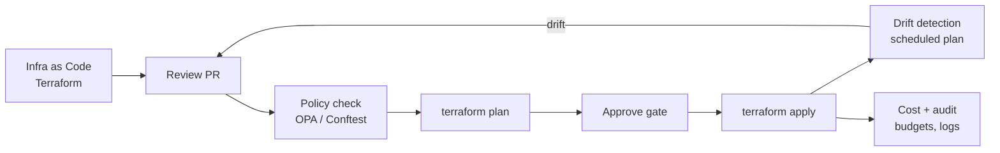

# Module 9 — Infrastructure & Cloud Governance

**Goal:** manage cloud infrastructure as **code**, and enforce **governance**
(policy, identity, tagging, cost, compliance) automatically — so environments are
consistent, auditable, secure, and cost-controlled.

## Why this matters
Modules 5–6 deploy the app. This module makes that deployment **governed**: no
click-ops, least-privilege by default, every resource tagged and policy-checked,
budgets enforced, and drift detected. This is what separates a demo from a
company-ready platform.

## What's here
```
iac/terraform/          # real Terraform for a governed Cloud Run service
  main.tf               # provider, least-privilege SA, Cloud Run + labels
  variables.tf          # typed inputs with validation (env, required labels)
  outputs.tf            # service URL + runtime SA
  terraform.tfvars.example
policy/
  require_labels.rego   # policy-as-code: deny resources missing governance tags
  require_labels_test.rego  # OPA unit tests for the policy (run in CI)
```

> **Enforced in CI:** the `governance` job in [.github/workflows/ci.yml](../.github/workflows/ci.yml)
> runs `tofu fmt`/`validate` and `opa check`/`opa test` on every push and PR, and
> blocks the deploy pipeline if either fails.

## The end-to-end governance flow


## Try it (needs Terraform + Conftest installed)
```bash
cd 09-infrastructure-governance/iac/terraform
terraform init
terraform fmt -check          # style gate
terraform validate            # schema gate
cp terraform.tfvars.example terraform.tfvars   # edit values
terraform plan -out plan.tfplan

# Policy-as-code gate (Open Policy Agent via Conftest)
terraform show -json plan.tfplan > plan.json
conftest test plan.json --policy ../../policy
```
> No cloud account needed to read the code and understand the patterns. `plan`
> requires GCP credentials; `validate`/`fmt` do not.

## The pillars of cloud governance
1. **Infrastructure as Code (IaC)** — Terraform / Bicep / Pulumi. Declarative,
   version-controlled, peer-reviewed, reproducible. No manual console changes.
2. **Landing zones & org structure** — orgs → folders → projects (GCP) /
   management groups → subscriptions (Azure) / OUs → accounts (AWS). Isolate
   environments and blast radius.
3. **Identity & access governance** — RBAC, least privilege, keyless auth
   (OIDC / Workload Identity Federation), no long-lived keys, periodic access review.
4. **Policy as code** — OPA/Conftest, GCP Org Policy, Azure Policy, AWS SCPs.
   Codify rules ("no public buckets", "must have labels", "approved regions only")
   and enforce them in CI and at the platform.
5. **Tagging / labeling standards** — every resource carries `team`,
   `cost_center`, `owner`, `environment`. Enables cost attribution and audits.
6. **Cost governance (FinOps)** — budgets + alerts, quotas, showback/chargeback,
   rightsizing, scale-to-zero. Tie back to Module 7.
7. **Security & compliance** — CIS benchmarks, encryption, network controls,
   evidence for SOC 2 / ISO 27001 / HIPAA. Continuous scanning.
8. **State & drift management** — remote/locked state, plan/apply gates in CI,
   scheduled drift detection to catch out-of-band changes.

## Cloud-native policy services (per provider)
| Concern | GCP | Azure | AWS |
|---------|-----|-------|-----|
| Org guardrails | Organization Policy | Azure Policy | Service Control Policies |
| Landing zone | Cloud Foundation Toolkit | Landing Zones / Bicep | Control Tower |
| Identity | IAM + WIF | Entra ID + Managed Identity | IAM + IAM Identity Center |
| Cost | Budgets + Quotas | Cost Management + Budgets | Budgets + Cost Explorer |

## Exercises
1. Add a policy that only allows approved regions.
2. Enforce `min_instances = 0` in dev but `>= 1` in prod via policy.
3. Add a remote Terraform backend (GCS/S3/Azure Storage) with state locking.
4. Add a scheduled CI job that runs `terraform plan` to detect drift.
5. Add a budget resource + alert to the Terraform.

## Definition of done
- [ ] Infra defined as code (Terraform) for at least one environment
- [ ] Standard labels/tags enforced (variable validation + policy)
- [ ] A policy-as-code check blocks non-compliant resources
- [ ] Least-privilege runtime service account, no static keys
- [ ] Budget/quota + drift detection documented

## 📚 References
- Terraform docs: https://developer.hashicorp.com/terraform/docs
- Open Policy Agent: https://www.openpolicyagent.org/docs/latest/
- Conftest (policy tests): https://www.conftest.dev/
- GCP Organization Policy: https://cloud.google.com/resource-manager/docs/organization-policy/overview
- Azure Policy: https://learn.microsoft.com/en-us/azure/governance/policy/overview
- AWS Service Control Policies: https://docs.aws.amazon.com/organizations/latest/userguide/orgs_manage_policies_scps.html
- CIS Benchmarks: https://www.cisecurity.org/cis-benchmarks
- FinOps Foundation: https://www.finops.org/
- Cloud Custodian: https://cloudcustodian.io/

See [notes.md](notes.md) for deeper reference.
