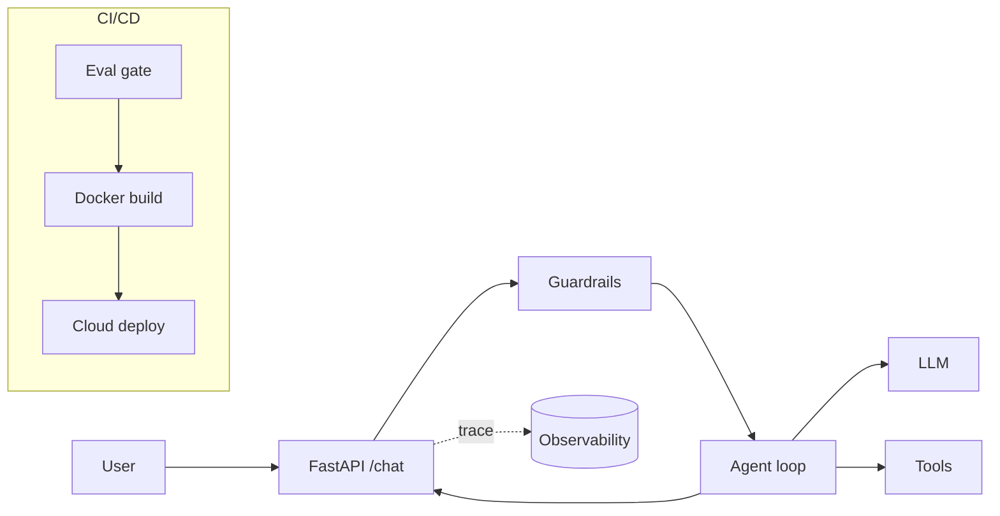

# ★ Capstone — Ship a Real Agentic System

Combine every module into one deployed, observable, safe, evaluated, optimized
agent. This is your portfolio piece.

## Requirements
- [ ] **Module 1** — FastAPI service with `/chat` + streaming
- [ ] **Module 2** — Eval suite with ≥20 domain cases + pass-rate report
- [ ] **Module 3** — Input/output guardrails + tool allowlist
- [ ] **Module 4** — Tracing on every request (tokens, cost, latency)
- [ ] **Module 5** — Deployed to a cloud runtime over HTTPS
- [ ] **Module 6** — Dockerized + CI (lint/test/eval gate) + auto build
- [ ] **Module 7** — Documented before/after cost & latency numbers
- [ ] **Module 8** — Real agent loop: tool use + retrieval (RAG) + memory
- [ ] **Module 9** — Infra as code (Terraform) + policy-as-code + tagging

## Suggested build
Pick ONE narrow, useful use case (aligns with a customer-centric focus):
a support-ticket triage agent, a docs Q&A agent, or a personal research agent.
Keep the scope tight and make it genuinely good at one thing.

## Deliverables
1. Running URL (or demo video).
2. `ARCHITECTURE.md` — diagram + key decisions + trade-offs.
3. Eval report (pass rate + a hard case you fixed).
4. One trace screenshot showing a full request.
5. A short "what I'd do next" section.

## Architecture sketch

## Stretch goals
- Multi-turn memory backed by Redis
- Model routing (small→large) with an escalation metric
- Semantic response cache
- Load test + published SLO
