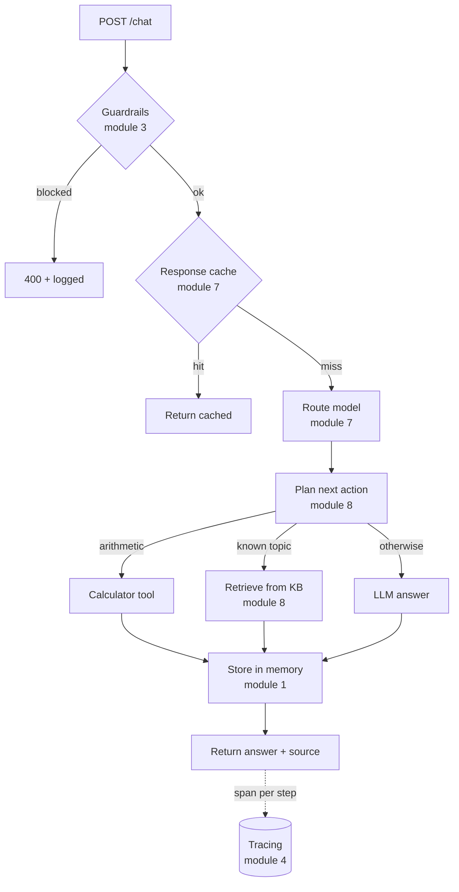

# Architecture — Support Agent

## Request flow

## Key decisions & trade-offs
- **Single agent + tools**, not multi-agent — simplest pattern that passes evals
  (module 8 principle). Add orchestration only if evals demand it.
- **Deterministic planner** (keyword routing) instead of an LLM planner, so the
  demo is reproducible and free. In production, swap `_plan()` for LLM function
  calling with validated arguments.
- **Cache before routing** — identical questions never hit a model twice.
- **RAG grounds answers** in a known knowledge base to avoid hallucination; the
  LLM path is a last-resort fallback.
- **Guardrails first** — untrusted input is validated before any work happens;
  blocked requests are counted in metrics.
- **Mock-by-default** — no API key required, so tests and evals run anywhere;
  real models plug in via env vars.

## Quality & operations
- **Evals** ([evals/run_eval.py](evals/run_eval.py)) score the real agent end to
  end and gate on a threshold (module 2).
- **Tracing** wraps every step; **metrics** track requests by source (module 4).
- **Docker** multi-stage image, non-root, `$PORT`-aware (module 6).
- **Deploy & govern** reuse the repo's CI/CD pipeline and Terraform/policy
  (modules 5, 6, 9).

## What I'd do next
- Replace the keyword planner with LLM function calling.
- Swap the token-overlap retriever for embeddings + a vector store.
- Add long-term memory (per-user facts) backed by a database.
- Add a semantic cache for near-duplicate questions.
